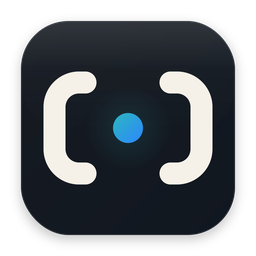

<p align="center">
  
</p>

# Simdock

[English](README.md)

Simdock是一个仅面向macOS的开源工具，用Rust构建，提供桌面应用和CLI，用于统一管理iOS Simulator与Android Emulator的环境检测、依赖安装和启动流程。

桌面端基于`iced`，命令行端用于自动化、脚本集成和贡献者调试。

## 功能特性

- 检测macOS是否已具备运行iOS模拟器和Android模拟器的基础环境。
- 检查Xcode、iOS运行时、Android SDK工具、Java、emulator、ADB和系统镜像。
- 桌面端支持iOS/Android Tab切换。
- 提供一键安装流程、当前步骤、进度和实时日志。
- 支持中文/English语言切换。
- 支持浅色、深色、跟随系统主题。
- 提供CLI命令，方便自动化和后续CI集成。

## 软件截图

截图暂未提交。建议将正式发布用PNG截图放到`assets/screenshots/`目录下，再通过相对Markdown图片路径引用到这里。

## 快速开始

环境要求：

- macOS。
- Rust工具链。
- iOS模拟器仍需要Xcode。Xcode本体由Apple分发，Simdock不会内置或绕过Apple的分发和授权机制。

运行桌面应用：

```bash
./scripts/run-desktop.sh
```

运行CLI环境检测：

```bash
./scripts/run-cli.sh doctor
./scripts/run-cli.sh --json doctor
```

检查整个workspace：

```bash
./scripts/check.sh
```

构建release版本并查看体积：

```bash
./scripts/build-release.sh
./scripts/size-report.sh
```

构建带Simdock图标的macOS`.app`和`.dmg`：

```bash
./scripts/package-macos.sh
```

## 项目结构

- `apps/simdock-cli/`：命令行应用。
- `apps/simdock-desktop/`：基于iced的桌面应用。
- `crates/simdock-core/`：领域模型、Provider和模拟器工作流。
- `crates/simdock-infra/`：应用目录、命令执行等基础设施。
- `docs/architecture.md`：架构和模块边界。
- `docs/development.md`：贡献者开发说明。
- `docs/packaging.md`：构建、发布和体积优化说明。
- `scripts/check.sh`：格式化和编译检查。
- `scripts/run-cli.sh`：CLI开发运行脚本。
- `scripts/run-desktop.sh`：桌面端开发运行脚本。
- `scripts/build-release.sh`：release构建脚本。
- `scripts/package-macos.sh`：macOS app bundle和DMG打包脚本。
- `scripts/size-report.sh`：release体积报告脚本。

## 文档

- [架构说明](docs/architecture.md)
- [开发说明](docs/development.md)
- [打包和体积优化](docs/packaging.md)
- [AI Agent协作说明](AGENTS.md)
- [贡献指南](CONTRIBUTING.md)
- [安全策略](SECURITY.md)

## 当前状态

Simdock仍处于早期阶段。当前重点是完善iOS/Android环境检测、托管iOS模拟器安装、托管Android SDK/AVD安装、模拟器启动流程和桌面端体验。

## License

MIT。详见[LICENSE](LICENSE)。
